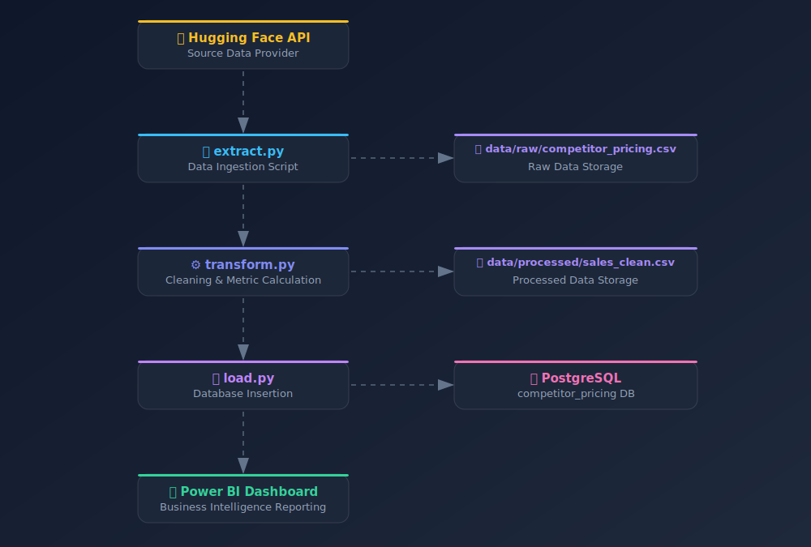

# Competitive Pricing Intelligence ETL Pipeline

> An end-to-end data pipeline that extracts Nigerian retail competitor pricing data, transforms it for competitive analysis, and loads it into PostgreSQL — with a Power BI dashboard for business intelligence reporting.

---

## Table of Contents

- [Overview](#overview)
- [Project Objective](#project-objective)
- [Project Structure](#project-structure)
- [Architecture Flow](#architecture-flow)
- [How It Works](#how-it-works)
- [Dataset Schema](#dataset-schema)
- [Technologies](#technologies)
- [Setup Instructions](#setup-instructions)
- [Dashboard](#dashboard)

---

## Overview

This pipeline extracts, cleans, and loads data from the [Hugging Face Nigerian Retail & E-commerce Competitor Pricing Dataset](https://huggingface.co/datasets/electricsheepafrica/nigerian_retail_and_ecommerce_competitor_pricing_datasets/viewer) into a PostgreSQL database for competitive market analysis.

What started as a simple data ingestion project evolved into a full competitive intelligence solution. The core question shifted from _"How is the business performing?"_ to _"How are we positioned in the market?"_; which drove the creation of derived metrics and a full BI report.

---

## Project Objective

- Extract competitor pricing data via the Hugging Face API
- Validate data and recalculate pricing metrics from source
- Load processed tables into PostgreSQL
- Build a business intelligence dashboard in Power BI

---

## Project Structure

```
competitive-pricing-etl/
│
├── src/
│   ├── extract.py
│   ├── transform.py
│   └── load.py
│
├── data/
│   ├── raw/
│   │   └── competitor_pricing.csv
│   └── processed/
│       └── sales_clean.csv
│
├── requirements.txt
└── README.md
```

---

## Architecture Flow



---

## How It Works

### Extract

- Connects to the Hugging Face dataset API
- Saves raw data to `data/raw/competitor_pricing.csv`

### Transform

- Drops null rows and normalizes column headers
- Removes source `price_difference_ngn` and `price_difference_percent` columns
- Recalculates `price_difference_ngn` and `price_difference_percent` from scratch
- Adds a `position_rank` column comparing our price vs. competitor price
- Reorders columns for downstream consistency
- Saves output to `data/processed/sales_clean.csv`

### Load

- Connects to PostgreSQL using environment variables
- Loads the cleaned data into the `competitor_pricing` database

---

## Dataset Schema

Source: [Hugging Face Dataset](https://huggingface.co/datasets/electricsheepafrica/nigerian_retail_and_ecommerce_competitor_pricing_datasets/viewer)

| Field                      | Type    | Example       |
| -------------------------- | ------- | ------------- |
| `comparison_id`            | String  | `COMP0000000` |
| `product_id`               | String  | `PRD80182`    |
| `product_name`             | String  | `Option`      |
| `our_price_ngn`            | Float   | `298984.47`   |
| `competitor_name`          | String  | `Spar`        |
| `competitor_price_ngn`     | Float   | `333817.21`   |
| `price_difference_ngn`     | Float   | `-45159.28`   |
| `price_difference_percent` | Float   | `8.85`        |
| `date_checked`             | String  | `2024-08-06`  |
| `in_stock_competitor`      | Boolean | `False`       |

---

## Technologies

| Tool                                                                                  | Purpose                                        |
| ------------------------------------------------------------------------------------- | ---------------------------------------------- |
| [Python](https://www.python.org/)                                                     | Pipeline scripting (extract, transform, load)  |
| [PostgreSQL](https://www.postgresql.org/)                                             | Relational database for storing processed data |
| [Power BI](https://learn.microsoft.com/en-us/power-bi/fundamentals/power-bi-overview) | Business intelligence dashboard                |
| [VS Code](https://code.visualstudio.com/)                                             | Development environment                        |

---

## Setup Instructions

### 1. Clone the Repository

```bash
git clone https://github.com/Chibutechie/competitive-pricing-etl.git
cd competitive-pricing-etl
```

### 2. Create a Virtual Environment

```bash
python -m venv myenv
source myenv/bin/activate        # macOS/Linux
myenv\Scripts\activate           # Windows
```

### 3. Install Dependencies

```bash
pip install -r requirements.txt
```

### 4. Configure Environment Variables

Create a `.env` file in the project root:

```bash
touch .env
```

Add your database credentials:

```env
DB_USER=your_username
DB_PASSWORD=your_password
DB_HOST=localhost
DB_PORT=5432
DB_NAME=database_name
```

### 5. Run the Pipeline

```python
from src.extract import extract
from src.transform import transform
from src.load import load

extract()
transform()
load()
```

Then verify that data has been loaded into your PostgreSQL database.

---

## Dashboard

The Power BI dashboard connects directly to PostgreSQL and visualizes competitive pricing positions across products and competitors.

### Setup Steps

1. Open Power BI Desktop and create a blank report
2. Click **Get Data → Database → PostgreSQL database**
3. Connect using your server credentials
4. Load the data into Power Query Editor for any final type normalization
5. Click **Close & Apply**
6. Create a date table for time-based analysis
7. Build your report visuals

> For more on connecting Power BI to PostgreSQL, see the [Microsoft documentation](https://learn.microsoft.com/en-us/power-bi/connect-data/).
